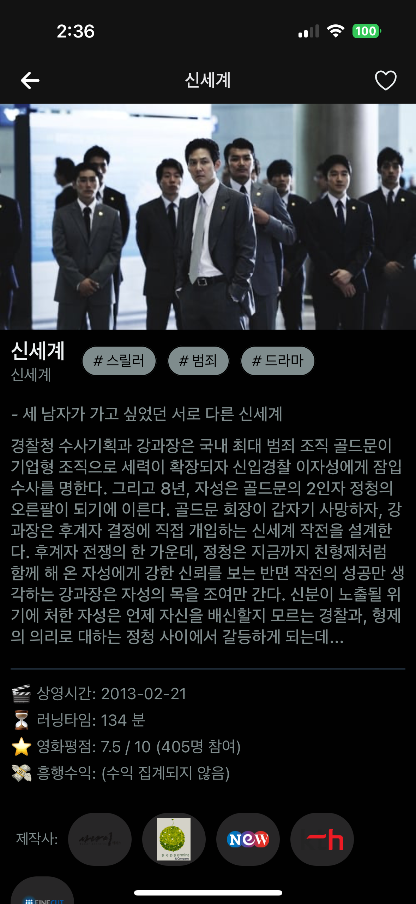

# Portfolio_WorldMovie
<h1 align="center">[React Native] 월드무비 <br/></h1>
<h2 align="center">(iOS & Android)</h2>

<div align="center">
  <br />
  <blockquote><b>The Information App that provide users detected water level.</b></blockquote>
  <pre align="center">App Store: <a href="https://apps.apple.com/kr/app/%EC%9B%94%EB%93%9C%EB%AC%B4%EB%B9%84/id6473882514">월드무비</a><br/></pre>
</div>

<br/>

<div align="center">
  
  
  
  
  <br />
</div>

<br/>

### Features

* Sign Up, Sign in, Withdrawal, Or view contents in guest mode, jwt token, userAuth.
* Navigation, SplashScreen, AsyncStorage, Axios, Module-resolver, Props, Flatlist, etc.
* User can view the different contents according to usertype.
* User can bookmark their contents to see them in bookmark screen.

### Example

```tsx
//App.js

const App = () => {
  switch (action.type) {
      case 'RETRIEVE_TOKEN':
        return {
          ...prevState,
          userToken: action.userToken,
        };
      case 'REGISTER':
        return {
          ...prevState,

 /* ... */
  const [loginState, dispatch] = React.useReducer(
    loginReducer,
    initialLoginState,
  );

  const authContext = React.useMemo(
    () => ({
      
      signIn: async (props) => {
        axios
          .post(`${BASE_URL}/api`, {
            props
          })
          .then(res => {
            console.log(res);
            if (res?.data?.ok === true) {

 /* ... */
return (
    <AuthContext.Provider value={authContext}>
      <NavigationContainer>
        <NativeStack.Navigator screenOptions={{headerShown: false}}>
          {loginState.userToken === null ? (
            <NativeStack.Screen name="Stack" component={Stack} />
          ) : (
            <>
              <NativeStack.Screen name="Tab" component={Tab} />
              <NativeStack.Screen name="DetailStack" component={DetailStack} />
            </>
          )}
        </NativeStack.Navigator>
      </NavigationContainer>
    </AuthContext.Provider>
  );
}
```

### Development Progress

* Started from App UI/UX design, App login logic configuration, Coding, http protocol communication to nodejs api configuration all by myself.
* Published successfully on Google Play Store when the user Auth is completed.
* Rejected by Apple about 10 times, they needed more function to publish on AppStore.
* Following Apple's construction, added guest mode login, added user bookmark logic (DB N:M logic).
* At last, finished the internal testing with using TestFlight and Google Play Console.
* Finally, published successfully on App Store.
